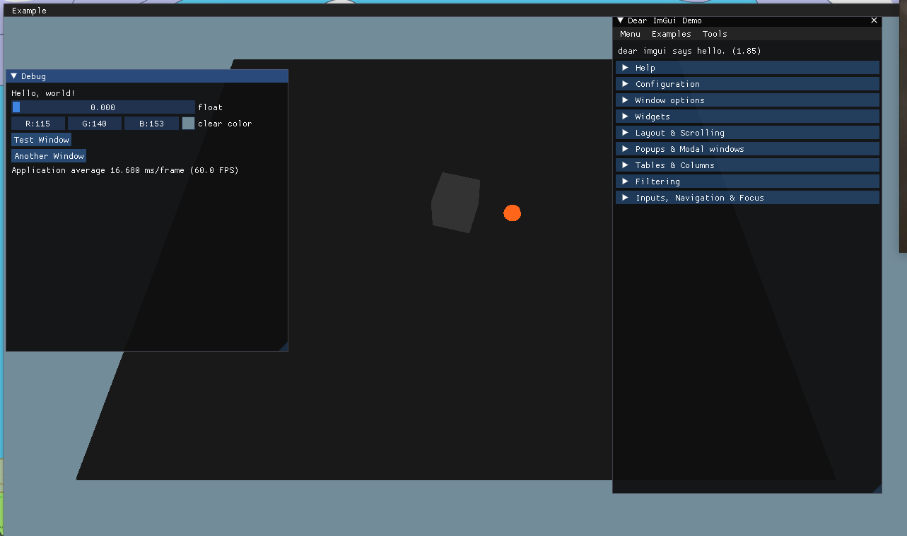

# OpenGL sample application with imgui support

It has diverged from its fork.

- Updated ImGui version.
- Added cmake based build system and conan package manager.
- Updated screenshot.
- [ ] Windows support may be broken now.

Based on the work done by [johnfercher](https://github.com/johnfercher) in PR
https://github.com/ocornut/imgui/pull/606 , which didn't land in the official
[imgui repo](https://github.com/ocornut/imgui).

Tested on Windows with MSVC 2015, and on Linux with the standard GNU compiler.
